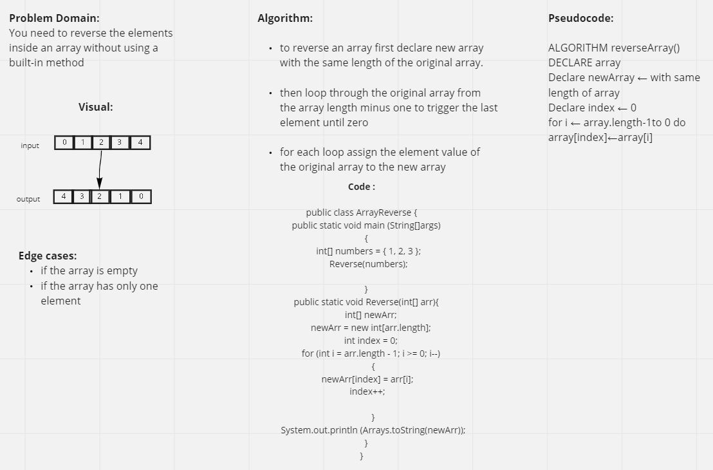

# Reverse an Array

this code returns a new array by reversing the elements of the original array

## Whiteboard Process

## Approach & Efficiency

Declare new array with the same length of the original array
and loop through the length of the original array, during each loop assign the last element in the original array for the first element in new array and so on..