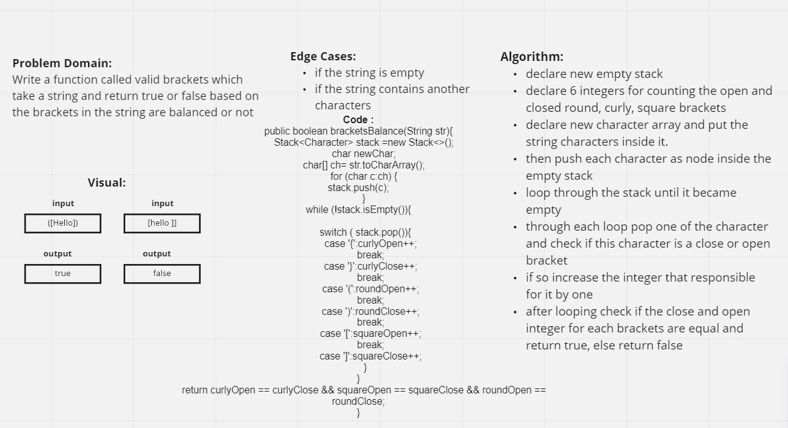

# Challenge Summary
### [code](../lib/src/main/java/challenges/stackAndQueue/Brackets.java)

### [test](../lib/src/test/java/challenges/stackAndQueue/BracketsTest.java)

this challenge was about creating valid brackets function which takes a String and return a boolean based on the brackets if they are balanced or not

## Whiteboard Process

## Approach & Efficiency

I approach this solution by creating a characater array that takes the string and add its characaters inside it.
then push each one of these characaters inside an empty stack. After that I looped through the stack until it became empty, at each loop I Popped a characater from the stack and I check if this characater is equals to one of these :`[,(,{,],),}` and if that was the case I increased an integer which is responsible for a single case by one, then after looping I checked if the both integers for each type of brackets are equal and return true, else return false

## Solution

To run the test type `./gradlew` test in the command line.
the link for the test file is above.