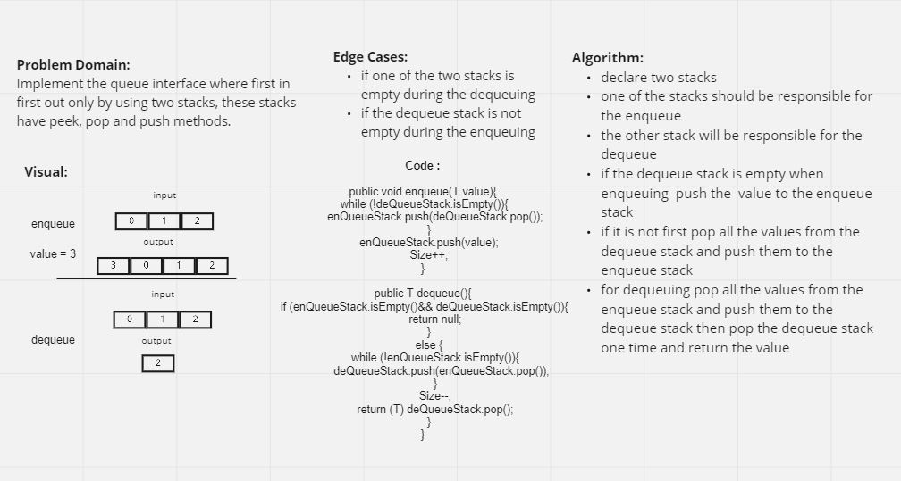

# Challenge Summary

[Code](../lib/src/main/java/challenges/stackAndQueue/PseudoQueue.java)   
[Test](../lib/src/test/java/challenges/stackAndQueue/PseudoQueueTest.java)

Identify and implement a efficient solution for the PseudoQueue.
where you should create a brand new PseudoQueue class that only 
uses two internal stacks for implementation.

## Whiteboard Process

## Approach & Efficiency

 I created two stacks: enqueue stack,
dequeue stack.  
in the enqueue or dequeue method I moved all nodes from one side to the other 
using `push()` and `pop()`.

## Solution

To see some examples press on the test code link above.

