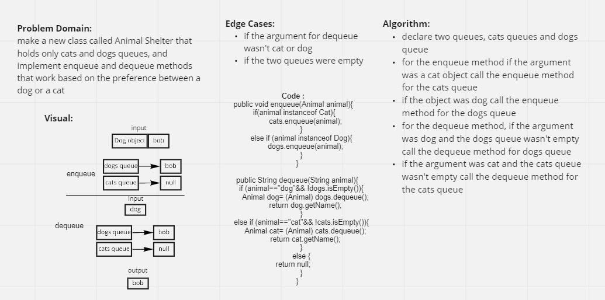

# Challenge Summary
### [code](../lib/src/main/java/challenges/stackQueueAnimalShelter)

### [test](../lib/src/test/java/challenges/stackQueueAnimalShelter/AnimalShelterTest.java)

this challenge was about creating animal shelter class which holds dogs and cats queues.
This class should be using the First in First out approach

## Whiteboard Process

## Approach & Efficiency

I approach this solution by creating an enqueue and dequeue methods for this class and I called the enqueue and dequeue methods for the dogs and cats queues inside them based on the arguments.

## Solution

To run the test type `./gradlew` test in the command line.
the link for the test file is above.

