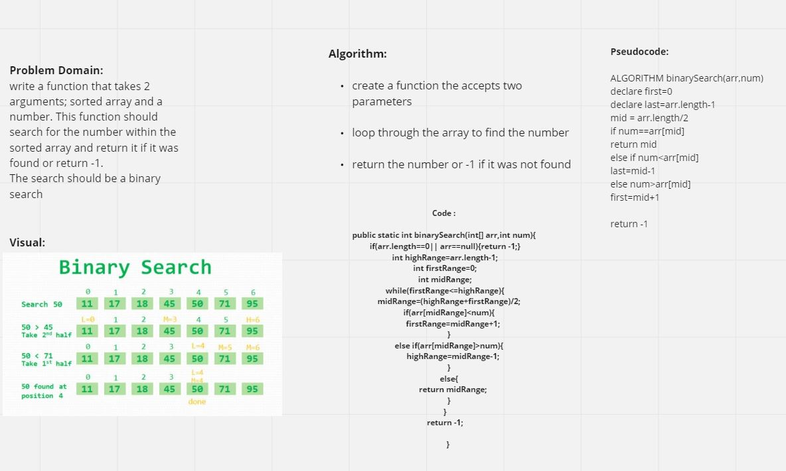

# Binary Search of Sorted Array

This code challenge uses a binary search algorithm to find the index of a specified value without using pre-defined java array methods.The function returns the index of the search value if found, and -1 if not found.

## Whiteboard Process

## Approach & Efficiency

I started looking up for different methods and trying them.