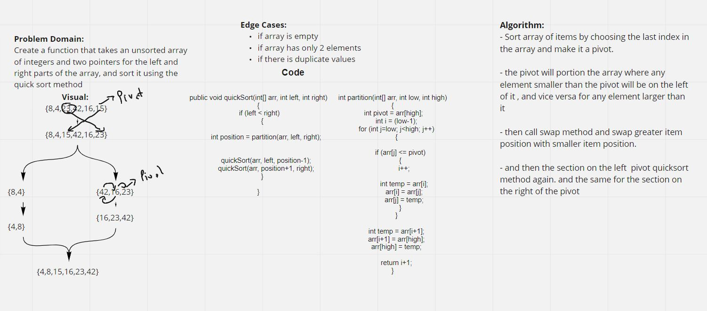

# Quick Sort

### [Code](./QuickSort.java)

### [Test](../../../../test/java/challenges/QuickSortTest/QuickSortTest.java)

## Challenge Summary


- Sort array of items by choosing the last index in the array and make it a pivot.
- the pivot will porition the array where any element smaller than the pivot will be on the left of it , and vice versa for any element larger than it

- then call swap method and swap greater item position with smaller item position.
- and then part of pivot on the left will call qucksort method again.
- also part on the right until all items on left of pivot and on right of pivot are in their correct position.

## Pseudocode

```java
ALGORITHM QuickSort(arr, left, right)
    if left < right
        // Partition the array by setting the position of the pivot value 
        DEFINE position <-- Partition(arr, left, right)
        // Sort the left
        QuickSort(arr, left, position - 2)
        // Sort the right
        QuickSort(arr, position, right)

ALGORITHM Partition(arr, left, right)
    // set a pivot value as a point of reference
    DEFINE pivot <-- arr[right]
    // create a variable to track the largest index of numbers lower than the defined pivot
    DEFINE low <-- left
    for i <- left to right do
        if arr[i] <= pivot
            Swap(arr, i, low++)
            
    // return the pivot index point
    return low

ALGORITHM Swap(arr, i, low)
    DEFINE temp <-- arr[i]
    arr[i] <-- arr[low]
    arr[low] <-- temp
```

## Approach

The recursive part of the method will call itself again and again until the length is less than 2 , this method takes 3 arguments :an array, and two integers;left and right to track the array. the method recursively sorts all the elements inside the array to smaller than a pivot in side and a greater than on the other side.

This approach sorts the array in place, so its return type is void.

## WHITEBOARD




## Efficiency 
- 
- Time complexity Big O(n^2)

- Space Complexity Big O(1) since it sorts the array in place.