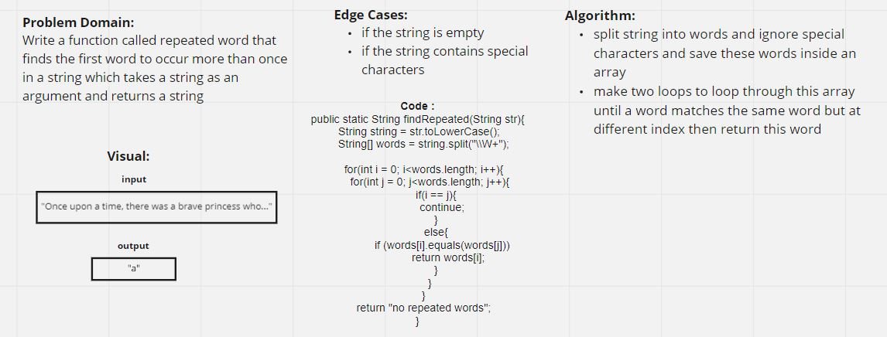

# Repeated Word

### [Code](./RepeatedWord.java)

### [Test](../../../../test/java/challenges/RepeatedWord/RepeatedWordTest.java)
## Challenge Summary

In this challenge, the input is a  String. It could be something like a paragraph , larger. The challenge is to return the first word which occurs in the string more than once.

## Whiteboard Process

## Approach & Efficiency

My approach was utilizing two nested loops to search for a ward that match the same word but at different index from the same array,

time complexity : O(n^2)

space complexity: O(n)

