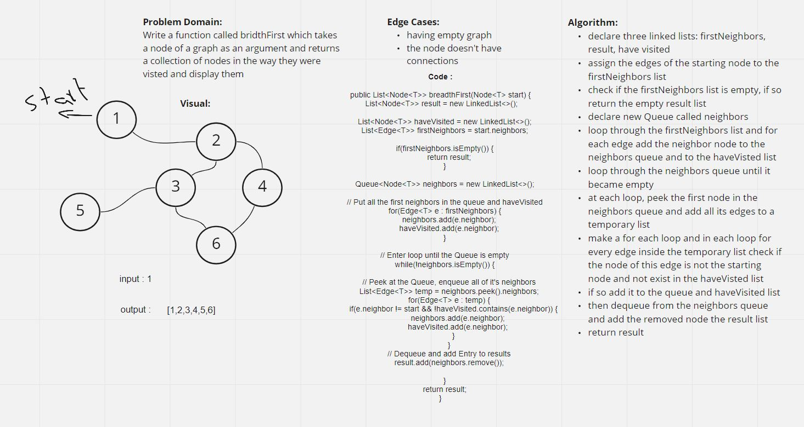

## Graph Breadth First

[CODE](../Graph.java)

[TEST](../../../../../test/java/challenges/GraphTest/GraphTest.java)

## Challenge Summary
This code challenge was to do a breadth first traversal on a Graph, and return a list of nodes in that order. The list takes a node as an input, so it will first contain a list of the "first neighbors", then the "second neighbors", and so on.

## Whiteboard Process

## Approach & Efficiency

In the end, I used a similar approach as I had done with a linked linked breadth first traversal by using a Queue. To do this I first added all the neighbors to Queue. Then I dequeued the first item (adding its node to the results list) and enqueued all of its neighbors to the back. This way I spread out by the nth neighbor.

To make this work with a graph, I also had to keep track of a list of nodes that I had already visited -since a Graph can have any number of connection and in any direction. I also checked to make sure I never added the same node that was input to the function.

Time Complexity : BigO(n^2)

Space Complexity: BigO(n)