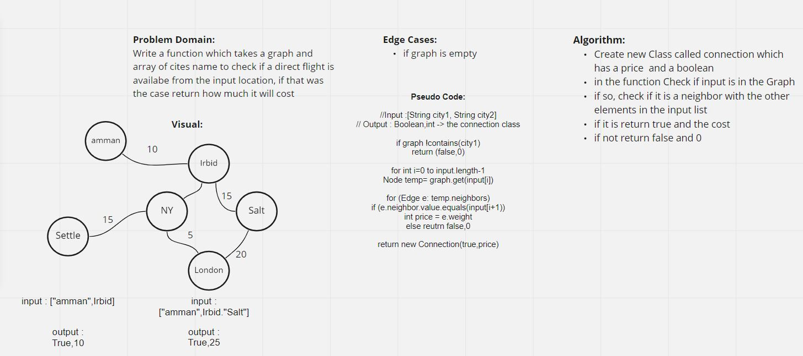

## Graph Business Trip

[CODE](../Graph.java)

[TEST](../../../../../test/java/challenges/GraphTest/GraphTest.java)

## Challenge Summary

In this challenge I wrote a method called getEdge() which takes in an array of city names. It then checks the graph to see if a full trip is possible with direct flights, and how much it would cost.

In order to accomplish this, I returned an object from a class I created called Connection. A connection has a field for the boolean on whether the trip is possible, and an int for the price.

## Whiteboard

## Approach & Efficiency

My approach was to use an outer for loop that iterates over the city names in the input String array. I then iterate over the nodes in the graph, and if a node is found with the same city name, it checks if it is neighbors with the next city in the input String array.

Time Complexity : BigO(n^3)

Space Complexity: BigO(1)