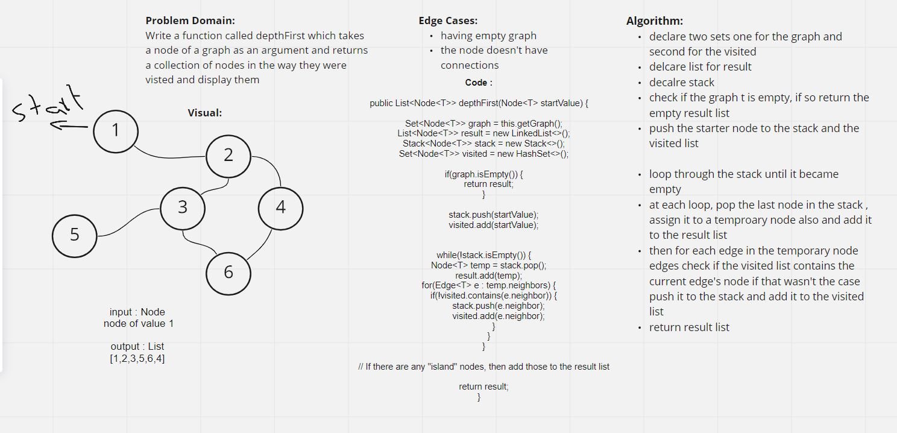

## Graph Breadth First

[CODE](../Graph.java)

[TEST](../../../../../test/java/challenges/GraphTest/GraphTest.java)

## Challenge Summary
In this challenge I wrote a method called depthFirst() which takes  a starting node, and returns a list of nodes in depth first (pre-order) traversal.
## Whiteboard Process

## Approach & Efficiency

To perform a depth first pre-order traversal, 
I used a Stack. Basically, the input node is pushed on the stack. 
Then entering a loop which runs until the stack is empty, 
I pop off the top node, add it to the results list, 
and add all its neighbor nodes to the Stack. 
This means we keep going deeper away from the input node before dealing with Nodes that are directly neighbors.

Time Complexity : BigO(n^2)

Space Complexity: BigO(n)