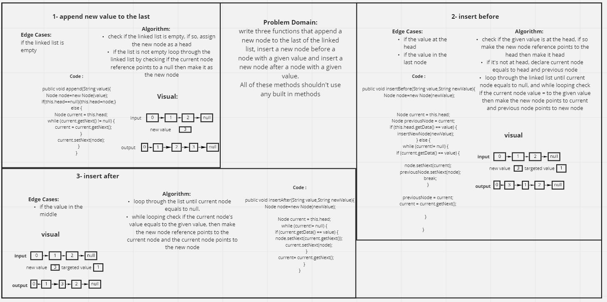

# Challenge Summary
In this challenge a three methods had been added to the linked list class: `append()`,
`insertBefore()`,and `insertAfter()`

## Whiteboard Process

## Approach & Efficiency
The approach For append method was to first check if the list was empty.
if so, make the new node as head. Else, loop through the list until you reach the last Node 
then make its reference points to the new node.

For insertBefore method, first check if the head has the value being searched for, 
if it is, make the new node the head. 
Else loop through the list. until the value had been found,
then I inserted it before the node with the given value and make the reference for new node
points to it.

## Solution
<!-- Show how to run your code, and examples of it in action -->