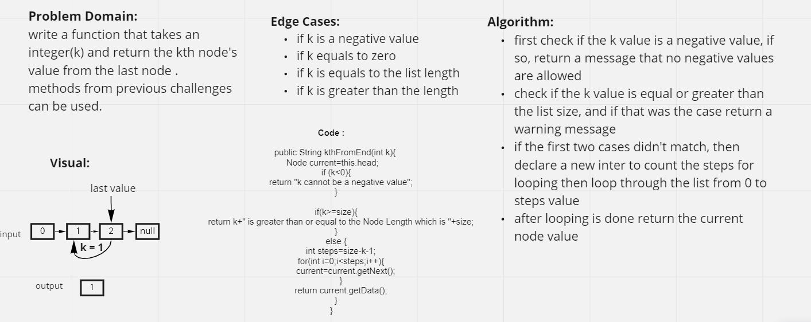

# Challenge Summary

This challenge asked for making a kth from last method which takes an intger(k) and return the kth node's value from the last node.

## Whiteboard Process

##  Approach & Efficiency

My approach for this challenge was by declaring new `int` called `steps` which will be the size of the list minus k mins 1 `size-k-1`.
and then loop through the list from 0 to the value of steps, and each time make the current node equals to the next node,
after the looping is done return the `current node` value.

# Solution
<!-- Show how to run your code, and examples of it in action -->

to run the code write `./gradlew test` in the terminal