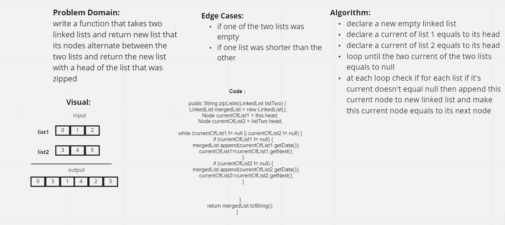

# Challenge Summary

In this challenge I was asked to zip a linked list with another list into a new linkedlist this linkedlist nodes will alternate between the two list.

## Whiteboard Process

##  Approach & Efficiency

I approach the solution for this challenge by making a while loop the loops until I reached the last node of the two lists.

At each loop I made two if condition to check if any of the two lists current node is not null, then append this node to new list.

## Solution

to run the code you can type ./gradlew test in the terminal to check if all tests passed