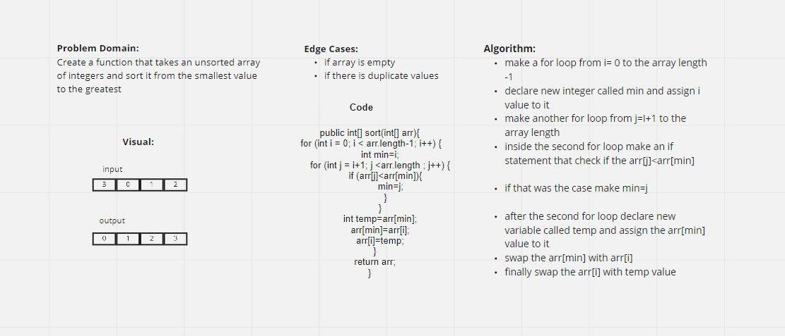

# Selection sort

### [Code](../lib/src/main/java/challenges/SelectionSort/SelectionSort.java)

### [Test](../lib/src/test/java/challenges/SelectionSort/SelectionSortTest.java)

## Challenge Summary

Insertion sort is a simple sorting algorithm that works by moving from the beginning of the list and comparing each value to the one before. if it finds that two values should be swapped (a 2 comes before a 1) then it would swap those two values and continue comparing the value that was moved down to the one on the left until it's in the right place.

### Explination

1. find smallest element in range an d select it.

2. add it to the first index position.

3. increase counter.

## Whiteboard Process



### Pseudocode

```java
SelectionSort(int[] arr)
    DECLARE n <-- arr.Length;
    FOR i = 0; i to n - 1  
        DECLARE min <-- i;  // current i is the new range
        FOR j = i + 1 to n
            if (arr[j] < arr[min])
                min <-- j;

        DECLARE temp <-- arr[min];
        arr[min] <-- arr[i];
        arr[i] <-- temp;
```

### Implementation

- the range is going to be the whole array so i can find the minimum number

- Numbers **before** selection sort : `[8,4,23,42,16,15]`

###### **Loop 1**

- after the first execution the counter will be increased by one, which means the range will become i+1

- at the first loop from the second for loop the if statement will be true, so the min integer will become j

- the temp variable now become 4 and arr[min] which is 4 now became 8 and arr[i] which is the 8 became 4 

- so npw the smallest number is **4** and swapped with **8**

  **- [4,8,23,42,16,15].**

###### **Loop 2**

- The smallest number in the range is **8** and  it kept it's place.

  **- [4,8,23,42,16,15].**

###### **Loop 3**

- The smallest number in the range now is **15** and swapped with **23** which is the first position in the new range.
- 
  **- [4,8,15,42,16,23].**


###### **Loop 4**

- The smallest number in the range is **16** and swapped with **42** which is the first position in the new range.

  **- [4,8,15,16,42,23].**

###### **Loop 5**

- The smallest number in the range now is **23** and swapped with **42** which is the first position in the new range.
  **- [4,8,15,16,23,42].**.


### Efficency
 the time complexity for this algorithim is **O(n^2)
