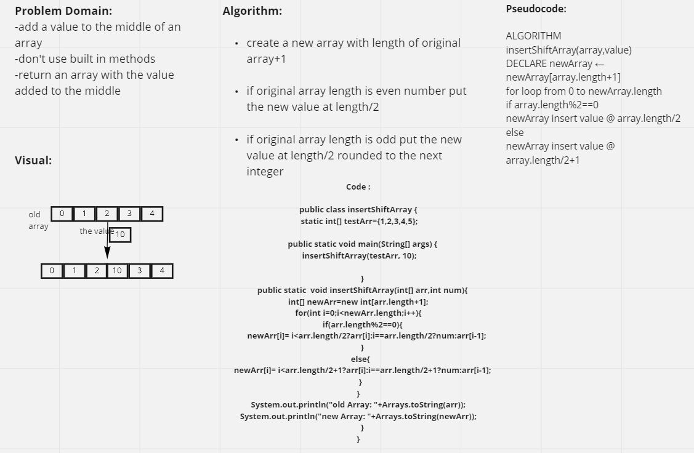

# Insert to Middle of an Array

Given an array of Ints, we have to figure out how to find the middle of the array,
create a new array with enough space to accommodate the existing values as well as the new one

, and insert the new value into the middle of the new array.

## Whiteboard process

## Approach & Efficiency

Because the challenge explicitly instructed us not to use array methods, I used a for loop and
conditional statements to determine the midpoint & create a new array.
