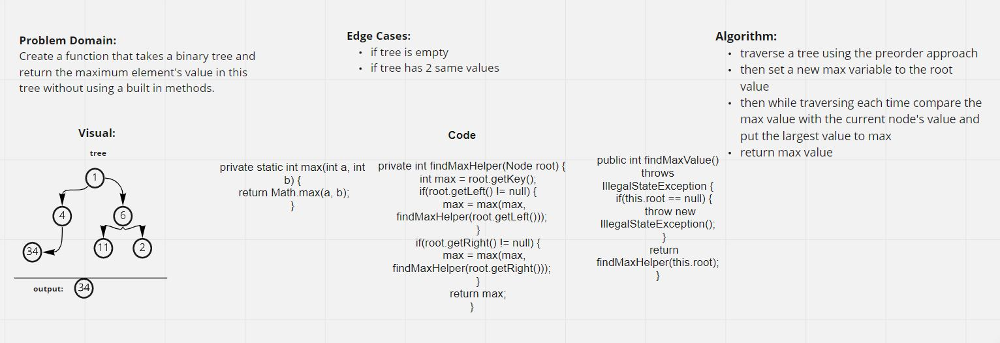

# Tree Max

### [Code](../../lib/src/main/java/challenges/tree/BinaryTree.java)

### [Test](../../lib/src/test/java/challenges/tree/TreeMaxTest.java)

## Challenge Summary

I made a method that returns the maximum value within a binary tree.

## Whiteboard Process

## Approach & Efficiency

I used recursion to compare max values in the tree.
To do this I made function where the recursion occurs,
and a simple helper function to find the max values.

## Solution

To show if the method works run ./gradlew test, and you can check the test from the link above.