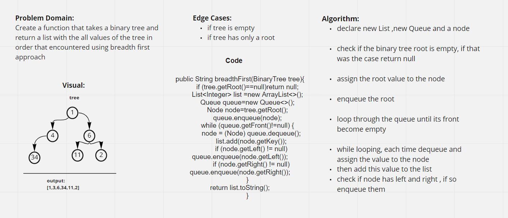

# BREADTH FIRST CHALLENGE

### [Code](../../lib/src/main/java/challenges/tree/BinaryTree.java)

### [Test](../../lib/src/test/java/challenges/tree/TreeBreadthFirstTest.java)

## Challenge Summary

Challenge was about making a function that takes a `Binary Tree` and return a list with all values of it using the breadth first approach.

## Whiteboard Process

## Approach & Efficiency

The approach I took was using a queue and loop through it until it became empty,
at first enqueue the root and dequeue it, at each time a dequeue happended check if this node has
a left or right, if that was the case enqueue them and so on.

## Solution

To show if the code is running type `./gradlew test` to check the tests in the link above.