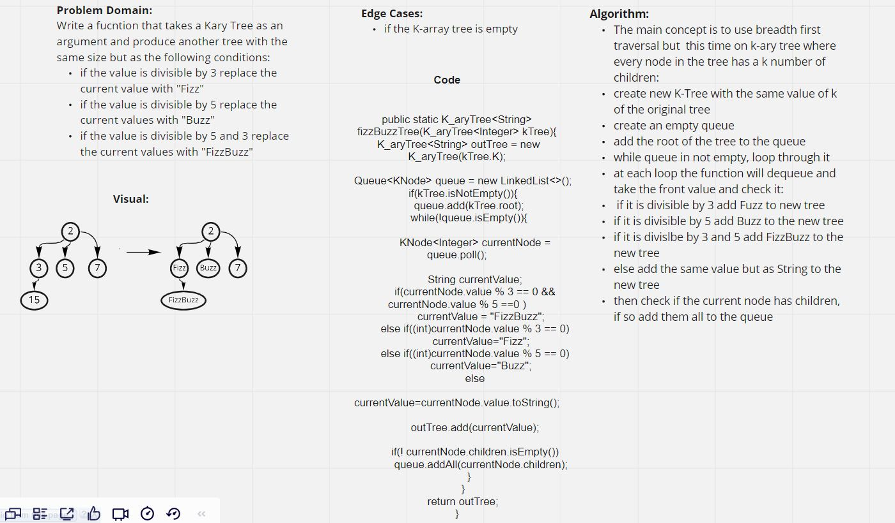

# FizzBuzzTree

### [Code](../../lib/src/main/java/challenges/tree/FizzBuzzTree.java)

### [Test](../../lib/src/test/java/challenges/tree/FizzBuzzTreeTreeTest.java)

## Challenge Summary

In this challenged I had to take in a `K-ary tree` as an argument, and then  determine weather or not the value of each node is divisible by 3, 5 or both, and change the value of each of the nodes:

If the value is divisible by 3, replace the value with `Fizz`

If the value is divisible by 5, replace the value with `Buzz`

If the value is divisible by 3 and 5, replace the value with `FizzBuzz`

## Whiteboard Process

## Approach & Efficiency

The main concept is to use breadth first traversal but  this time on k-ary tree where every node in the tree has a k number of children:
create new K-Tree with the same value of k of the original tree
create an empty queue
add the root of the tree to the queue
while queue in not empty, loop through it
at each loop the function will dequeue and take the front value and check it:
if it is divisible by 3 add Fuzz to new tree,
if it is divisible by 5 add Buzz to the new tree,
if it is divislbe by 3 and 5 add FizzBuzz to the new tree,
else add the same value but as String to the new tree,
then check if the current node has children, if so add them all to the queue
## Solution

To see if the solution is running or not check the test code above